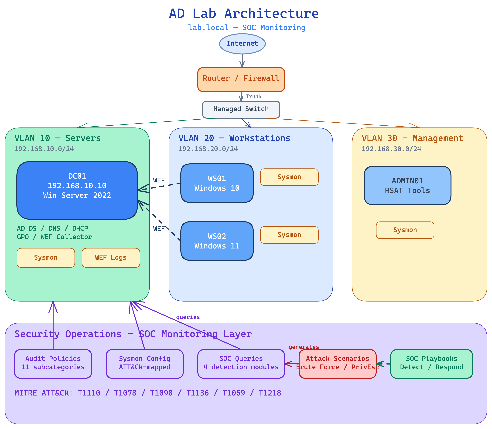

# AD-Lab-Setup

Home lab Active Directory environment with automated provisioning, security monitoring, and SOC detection scenarios. Built to simulate a small enterprise domain for practising IT support, systems administration, and security operations.

## Architecture



## What This Demonstrates

### IT Support & Systems Administration

| Skill | Implementation |
|---|---|
| **Active Directory** | Forest/domain creation, OU hierarchy, user lifecycle, service accounts |
| **Group Policy** | Password policies (secedit), audit policies, drive mappings, USB restrictions |
| **Network Services** | DNS, DHCP with multi-VLAN scoping, VLAN segmentation |
| **PowerShell Automation** | 9 provisioning scripts — repeatable, idempotent, fully automated |
| **Troubleshooting** | Step-by-step guides for common AD, DNS, DHCP, and GPO issues |

### SOC Analyst & Security Operations

| Skill | Implementation |
|---|---|
| **Endpoint Monitoring** | Sysmon deployment with ATT&CK-mapped detection rules (12 event IDs) |
| **Log Collection** | Windows Event Forwarding — DC01 as centralised collector |
| **Detection Engineering** | 4 SOC query scripts: failed logons, lockouts, privilege escalation, suspicious processes |
| **Threat Simulation** | Attack scripts generating realistic telemetry (brute force, privilege escalation) |
| **Incident Response** | Full playbooks: detect, investigate (timeline reconstruction), respond, recover |
| **MITRE ATT&CK** | Techniques mapped throughout: T1110, T1078, T1098, T1136, T1087, T1059, T1218 |

## SOC Scenarios

Hands-on detection scenarios with attack simulations and SOC playbooks. Each scenario includes a simulation script to generate realistic telemetry and a playbook walking through the full detect, investigate, and respond workflow.

| Scenario | MITRE ATT&CK | Description |
|---|---|---|
| [Brute Force Detection](scenarios/01-brute-force/PLAYBOOK.md) | T1110.001, T1110.003 | Brute-force and password spraying simulation, failed logon analysis, credential compromise investigation |
| [Privilege Escalation](scenarios/02-privilege-escalation/PLAYBOOK.md) | T1078, T1098, T1136, T1087 | Insider threat with unauthorized group changes and backdoor accounts, full kill chain investigation |

## Quick Start

### Prerequisites

- Windows Server 2022 (evaluation ISO works)
- Hypervisor: VirtualBox, Hyper-V, or VMware
- At least 8 GB RAM for DC + 1 workstation

### Step 1: Promote Domain Controller

```powershell
# Run as Administrator on Windows Server
.\scripts\01-Install-ADForest.ps1
# Server will reboot automatically
```

### Step 2: Build OU Structure and Provision Users

```powershell
# After reboot, run in order:
.\scripts\02-Create-OUStructure.ps1
.\scripts\03-Create-Users.ps1
.\scripts\04-Create-SecurityGroups.ps1
.\scripts\05-Configure-GPOs.ps1
.\scripts\06-Configure-DHCP.ps1
.\scripts\07-Create-ServiceAccounts.ps1
```

### Step 3: Deploy Security Monitoring

```powershell
# Deploy Sysmon (requires Sysmon64.exe — see script for download instructions)
.\scripts\08-Deploy-Sysmon.ps1

# Configure Windows Event Forwarding (centralise logs on DC01)
.\scripts\09-Configure-WEF.ps1
```

### Step 4: Join Workstations

Follow [docs/02-Workstation-Join.md](docs/02-Workstation-Join.md) to join Windows clients to the domain.

### Step 5: Run SOC Scenarios

```powershell
# Simulate a brute force attack and investigate
.\scenarios\01-brute-force\Simulate-BruteForce.ps1
.\scripts\soc-queries\Get-FailedLogons.ps1 -Hours 1

# Simulate privilege escalation and investigate
.\scenarios\02-privilege-escalation\Simulate-PrivilegeEscalation.ps1
.\scripts\soc-queries\Get-PrivilegeEscalation.ps1 -Hours 1
```

## Repository Structure

```
AD-Lab-Setup/
├── scripts/
│   ├── 01-Install-ADForest.ps1       # Promote server to DC and create forest
│   ├── 02-Create-OUStructure.ps1     # Build OU hierarchy
│   ├── 03-Create-Users.ps1           # Bulk user provisioning from CSV
│   ├── 04-Create-SecurityGroups.ps1  # Security groups and membership
│   ├── 05-Configure-GPOs.ps1         # Group Policy (password, audit, USB, updates)
│   ├── 06-Configure-DHCP.ps1         # DHCP scope and options (3 VLANs)
│   ├── 07-Create-ServiceAccounts.ps1 # Service account provisioning
│   ├── 08-Deploy-Sysmon.ps1          # Sysmon deployment and config updates
│   ├── 09-Configure-WEF.ps1          # Windows Event Forwarding setup
│   ├── soc-queries/
│   │   ├── Get-FailedLogons.ps1      # Detect brute-force attempts (T1110)
│   │   ├── Get-AccountLockouts.ps1   # Track lockouts with source correlation
│   │   ├── Get-PrivilegeEscalation.ps1 # Monitor privilege and group changes (T1078/T1098)
│   │   └── Get-SuspiciousProcesses.ps1 # Flag suspicious process patterns (T1059/T1218)
│   └── users.csv                     # Sample user data (no passwords)
├── sysmon/
│   └── sysmon-config.xml             # SOC-tuned Sysmon config (ATT&CK-mapped)
├── scenarios/
│   ├── 01-brute-force/
│   │   ├── Simulate-BruteForce.ps1   # Attack simulation (brute force + password spray)
│   │   └── PLAYBOOK.md               # SOC detection and response playbook
│   └── 02-privilege-escalation/
│       ├── Simulate-PrivilegeEscalation.ps1  # Insider threat simulation
│       └── PLAYBOOK.md               # SOC investigation playbook (full kill chain)
├── diagrams/
│   └── architecture.excalidraw.png   # Architecture diagram
├── docs/
│   ├── 01-DC-Setup.md                # Domain Controller build guide
│   ├── 02-Workstation-Join.md        # Domain join procedure
│   └── 03-Troubleshooting.md         # Common issues and fixes
└── README.md
```

## Documentation

| Guide | Description |
|---|---|
| [DC Setup](docs/01-DC-Setup.md) | Domain Controller build from scratch |
| [Workstation Join](docs/02-Workstation-Join.md) | Domain join procedure with verification |
| [Troubleshooting](docs/03-Troubleshooting.md) | Common AD, DNS, DHCP, and GPO issues |
| [Brute Force Playbook](scenarios/01-brute-force/PLAYBOOK.md) | SOC scenario: detect and respond to brute force |
| [Privilege Escalation Playbook](scenarios/02-privilege-escalation/PLAYBOOK.md) | SOC scenario: investigate insider threat |
